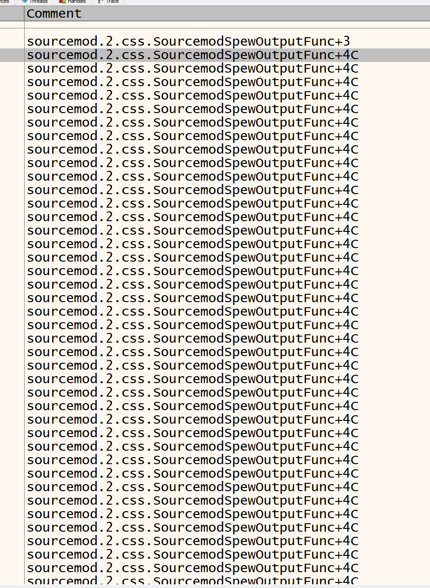
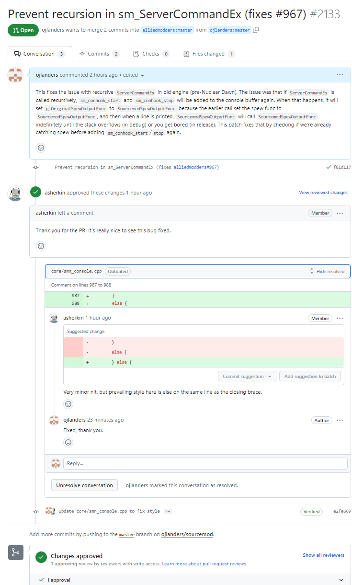
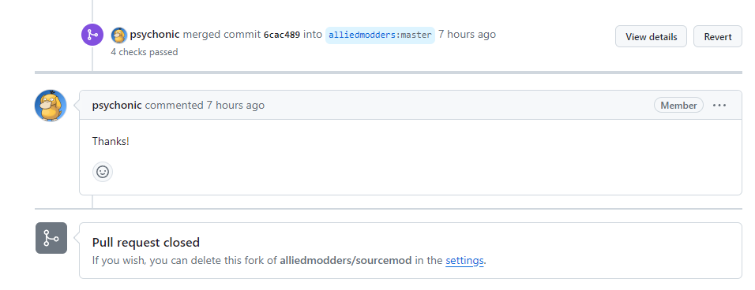

For my contribution to SourceMod, I decided to investigate and fix the bug "ServerCommandEx() can't grab stats output (#967)" in SourceMod. The issue described a problem with the `ServerCommandEx()` native not being able to capture the output of certain commands like `stats` when executed from a server console command handler. It could apparently cause the server to hang indefinitely if `ServerCommandEx()` was used within a sub-command.

SourceMod is a modding framework for different Source engine games, that provides a scripting language (SourcePawn) that can be used to manipulate game behavior without the original source code of the game DLLs.

To start investigating, I set up a test environment.  The original issue was reported on Team Fortress 2, but I had a hunch that with the new Team Fortress 2 updates (especially the x64 update) it might be harder to reproduce. (I was right.) 

So I decided to try reproducing it on an older game - Counter-Strike: Source (mainly because it loads very quickly). After freeing up some disk space, I set up my CS:S client to have SourceMod installed. 

Next, I created a simple SourceMod plugin containing the reproduction code from the GitHub issue:

```c
#include <sourcemod>

public void OnPluginStart()
{
  RegConsoleCmd("sm_stats", CmdStats);
}

public Action CmdStats(int iClient, int iArgC) 
{
  char szBuffer[512];
  ServerCommandEx(szBuffer, sizeof(szBuffer), "stats");
  
  ReplyToCommand(iClient, "Command length response: %d", strlen(szBuffer));
  ReplyToCommand(iClient, "Command output:\n%s", szBuffer);
  return Plugin_Handled;
}
```

I followed the reproduction steps:

1. Join server with admin access to `sm_rcon`  
2. Execute `sm_rcon stats` - output is received (working as expected)
3. Execute `sm_stats` - output is received (also working)
4. Execute `sm_rcon sm_stats` - and nothing? Seemed to work fine.

SourceMod supports many different Source engine based games, both "listen" servers (the ones provided for singleplayer games where the client and server are the same entity), and "dedicated" servers (servers running the Source engine in "dedicated" mode, without any client code running). 

So I figured it was probably an issue on dedicated only (after all, that's what the guy tested on), and after freeing 15.7 GB of disk space, I had a Counter-Strike: Source dedicated server, and on that dedicated, running "sm_rcon sm_stats" froze.

So now I had a reproducible test case. Time to dive into the SourceMod code and figure out what's going on under the hood when `ServerCommandEx` is called.

It turns out that on "old" Source engine branches, to capture the output of a command, SourceMod uses a clever trick. It registers its own log output callback via `SpewOutputFunc` from `tier0.dll`, surrounding the actual command with two special console commands - `sm_conhook_start` and `sm_conhook_stop`. These commands switch SourceMod's custom output callback on and off. 

The problem arises if `ServerCommandEx` is called recursively. In that case, the `sm_conhook_start` and `sm_conhook_stop` commands get added to the console command buffer again, even though the hooks are already active. This causes the output callback to recurse into itself endlessly, leading to the server freeze.



Luckily the fix is quite simple - there's already a variable `g_ShouldCatchSpew` to track if the hooks should be active and to only allow executing the conhook commands if it's true. So I simply made it so it skips adding the hook commands again if the variable is true:

```c
	if (!g_ShouldCatchSpew) {
		g_ShouldCatchSpew = true;
		engine->ServerCommand("sm_conhook_start\n");
		engine->ServerCommand(buffer);  
		engine->ServerCommand("sm_conhook_stop\n");
	}
	else {
		engine->ServerCommand(buffer);
	}
```

And with that, the `sm_rcon sm_stats` command now works as expected without freezing the server! I opened a pull request with the fix, and hopefully it will be merged soon.

After that, I made a PR to get the bug fix merged, since other people were facing that issue. A maintainer said it was nice to have that bug fixed, and then asked me to make a slight style change, which I did:



And then it was merged!




This was a fun bug to investigate, I learned a lot about how SourceMod interfaces with the Source engine internals. It's neat how they capture console output like that.


