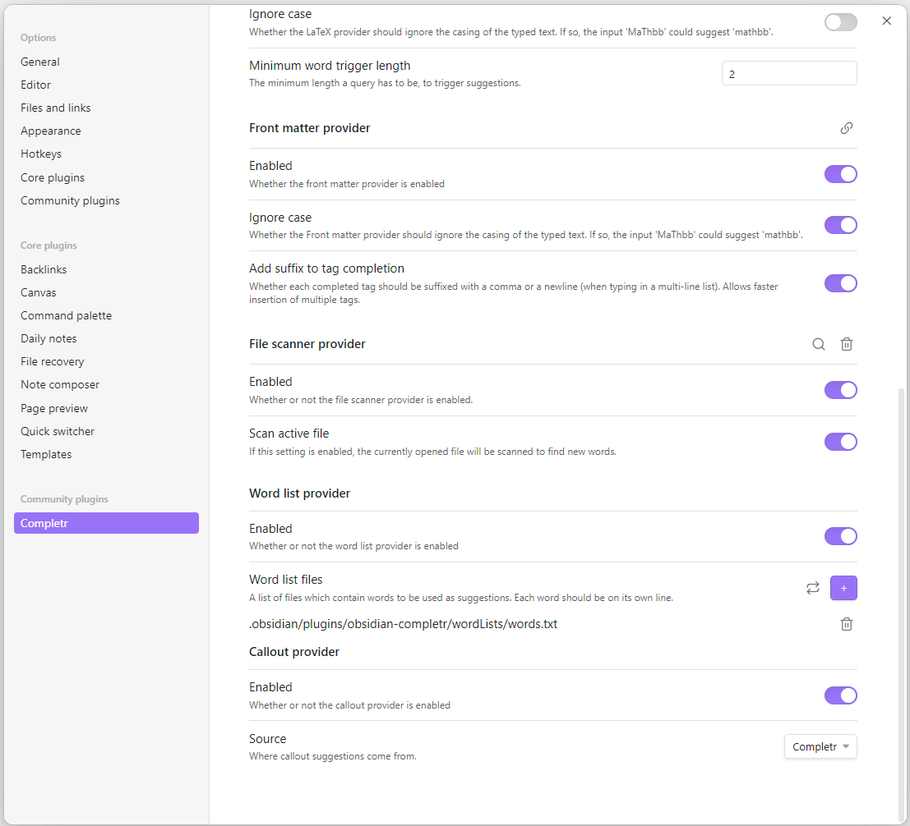
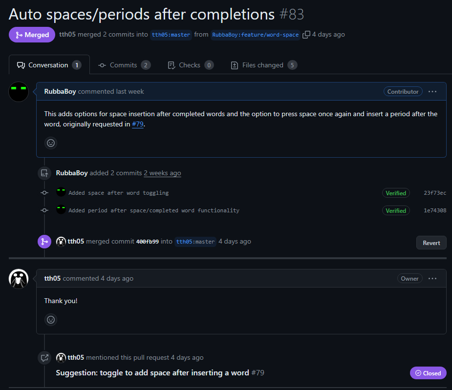

## What/Why an Obsidian plugin?
Obsidian is a piece of software, used for note-taking and as a general knowledge database. It is not open source, however it uses markdown files for most things so it doesn't necessarily lock you in to just that software. I used to use Obsidian a lot more than I do now, however their plugin system came to mind when I was thinking of something to work with. They have a great TypeScript API which makes plugins relatively simple to make. One annoyance I remember having with a plugin I use for autocompletion (or English, LaTeX, and more), [Completr](https://publish.obsidian.md/hub/02+-+Community+Expansions/02.05+All+Community+Expansions/Plugins/obsidian-completr), was the lack of the ability to add spaces after completed words, which seemed common in most other areas. At the beginning of this year it appears someone else wanted this as well, as an issue was made for it, unresolved. The created issue also mentioned wanting the ability to optionally add a period after a second space after a completed word, so I figured I would add that in as well.

Luckily, this plugin already had a lot of configurable options, which made this a very nice optional thing to add, without messing up anyone else's workflow on this popular plugin.

## What makes this a good project?

This project caught my attention primarily because it was something I personally used. It also is rather popular, amassing over 130k downloads. Development hasn't been very active as of recently, however the codebase is very clean and organized, and made it easy to navigate. Aside from not much recent development, it seemed like a decent project to work with.

## Implementation

Implementing this functionality wasn't initially straightforward, simply because of how the plugin system worked. Everything is well documented, however this plugin uses some more advanced features that require a little bit of domain knowledge to understand, and especially for a clean implementation that works nicely with everything else. There were two parts to this fix, the automatic adding of spaces, and adding periods.

For both of these, I needed to add some fields to their `settings.ts` file, which defined checkboxes, dropdowns, and any other configurable options for the user. For period inserting, I needed to keep track of the user's keypresses and cursor movements, which involved adding a small class to keep track of if a period could be inserted at the current moment. If the user completed a word and a space was inserted after it, then it is a valid time. If the user did any other interaction, it was not.

For both adding periods and spaces, the `Editor#replaceRange` and `Editor#setCursor` methods had to be used. The former sets text at a cursor object, and the latter changes the cursor position. For the space after a completion, the following code was used:


const cursor = editor.getCursor()
editor.replaceRange(" ", cursor)
editor.setCursor({line: cursor.line, ch: cursor.ch + 1})


That sets a space at the current cursor location (directly after a completed word), and then moves the cursor right after the space just inserted. Similar logic was used for adding a period.

## Success

After these changes and some tweaking/bug fixing, the PR was made and accepted quite easily after a few days. Nothing major was blocking me, and this was a very useful but not too complex thing to add.

