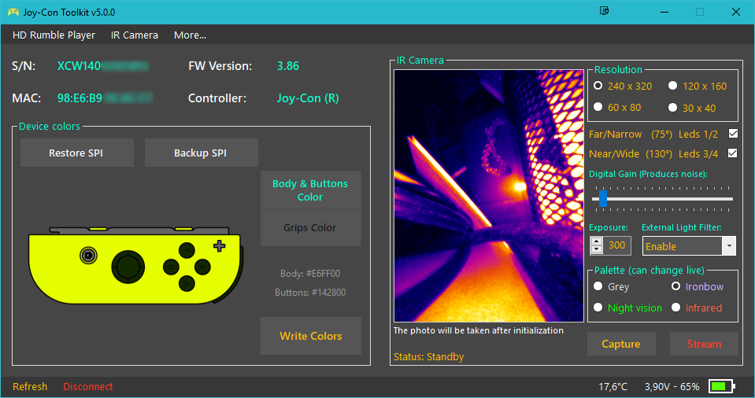
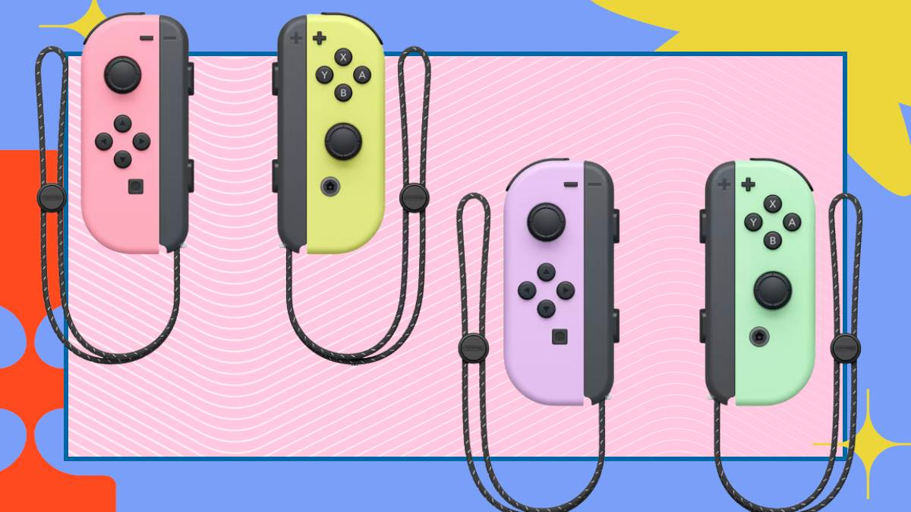
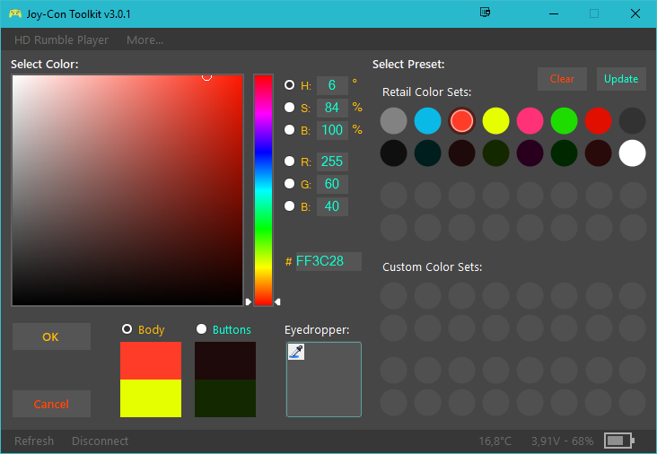
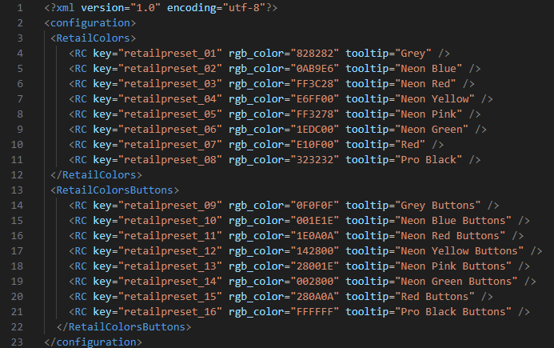
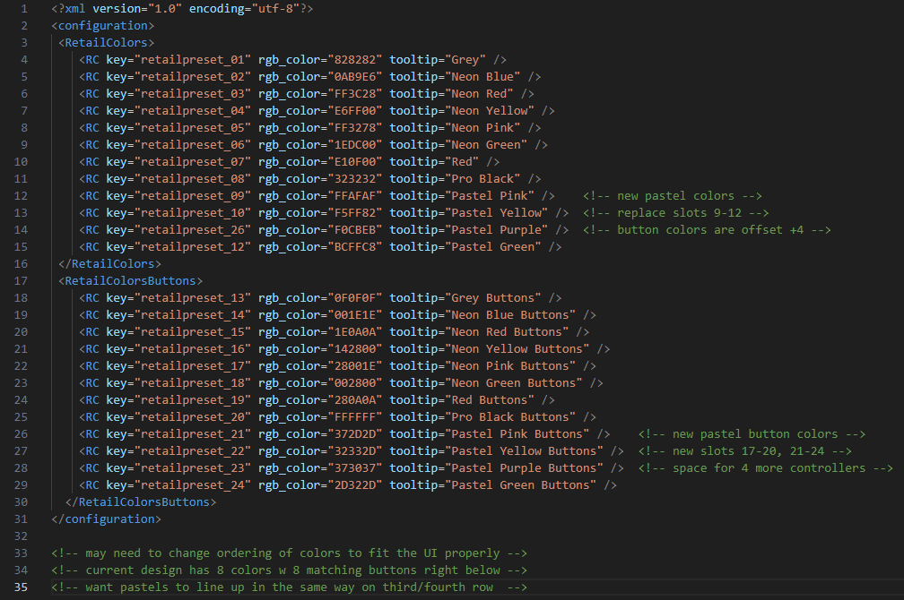
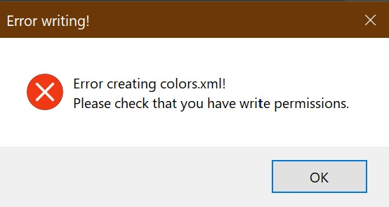
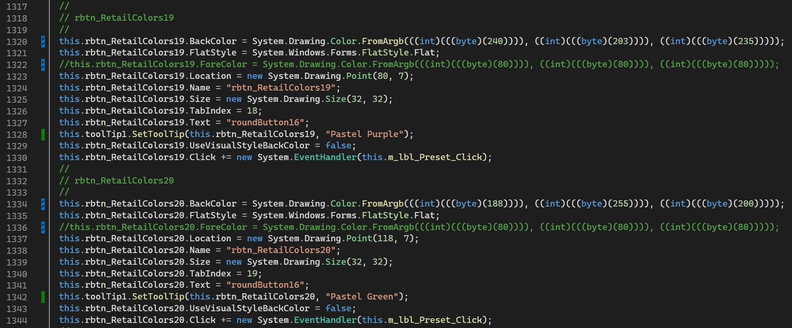
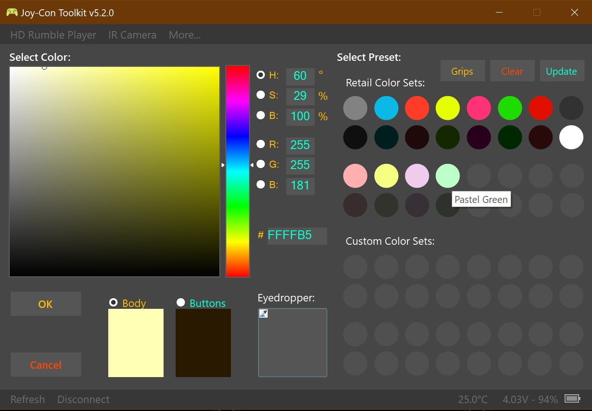
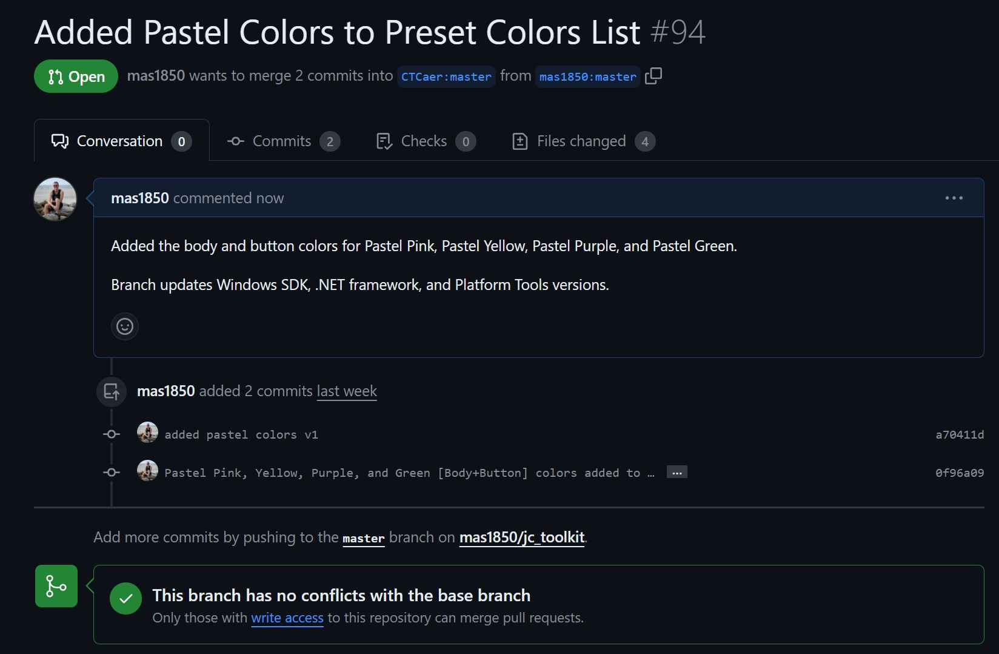

## **Joy-Con Toolkit**
For my bug fix, I decided to work on a project called Joy-Con Toolkit by CTCaer.

### Introduction
Nintendo Switch controllers (Joy-Con) come in all sorts of exciting and exclusive colors, in both their physical and digital representations. Many gamers modify their controllers with custom cases and paint jobs, meaning their digital controllers no longer look like their physical ones. By connecting their controller to a PC with [Joy-Con Toolkit](https://github.com/CTCaer/jc_toolkit), controller modders can alter the appearance of their peripherals.

JC Toolkit is able to change the digital values of two Joy-Con colors or four Pro Controller colors, as well as backup SPI flash, calibrate/test/debug controller features, take pictures with the Right Joy-Con's IR camera, and more.

I chose this project because I recently wanted to use this program on my PowerA Pro Controller, but I wasn't able to connect the device to the application. One of the most glaring issues with this project is that it only works with official Nintendo controllers, not 3rd or even 2nd-party controllers like mine.

This project has no onboarding features or other relevant resources. The README.md file lists operation prerequisites and other referenced GitHub projects. Some people have worked on their own forks of the Joy-Con Toolkit, but most of the actual development has come from only two programmers. The only [forum](https://gbatemp.net/threads/tool-joy-con-toolkit.478560/) for the program is an 85-page mess of replies hosted on GBA Temp. For a first open-source software project, it would be challenging to work with.

### The Bug Fix

Much of this program is above my level of understanding, so there were few bug fixes I felt I had a chance to resolve. My solution was to resolve Issue #83: "Pastel Joy-Cons Hex Codes?" The current user interface displays hex colors for eight standard colors (body + buttons), with space for eight more. While the Issue only asks for the Pastel Pink and Yellow colors, I added all four Pastel colors (Pink, Yellow, Purple, and Green) to the program.

First I made a fork of the project for me to work on. I then opened this workspace in Visual Studio with the 2017 C++ Redistributable and the Microsoft .NET Framework 4.7.1 installed, as per the mentioned prerequisites. In order to find the file I had to work on, I searched the workspace for "0AB9E6" (the Neon Blue hex code) and found the file "retail_colors.xml".

For my first draft, I made a few changes with some inconsistencies to learn the behavior of the design. My first assumption was to add more RC tags to the RetailColors and RetailColorsButtons tags. I added the four new colors to each parent tag and adjusted the numbers to increase as expected. Wondering if the preset number was the determining factor of the color's position, I changed the Pastel Purple color preset from 11 to 26.

Here, I have many issues trying to debug the Visual Studio solution. I received a multitude of error messages, including issues with Windows SDK and .NET version differences. After meeting with Adrian, I was eventually able to launch the solution on my laptop. This is when I noticed no change within the program.

After fiddling with the UI some more, I found a label titled "Xenoblade Grips". Knowing that the word Xenoblade was unlikely to be used frequently, I searched the project for the word and found the correct file, named "frmJoyConColorPicker.cs". Using the foundations for color slots 17-20 and 25-28 left in the C# source code file, I added the labels and RGB codes for the eight new pastel colors.

Once ensuring my bug fix worked, I pushed my changes to my GitHub fork, and created a pull request to merge my project with the main branch by CTCaer. While I do not expect the changes to be merged (abandoned project), you can see the pull request below.

