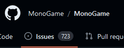
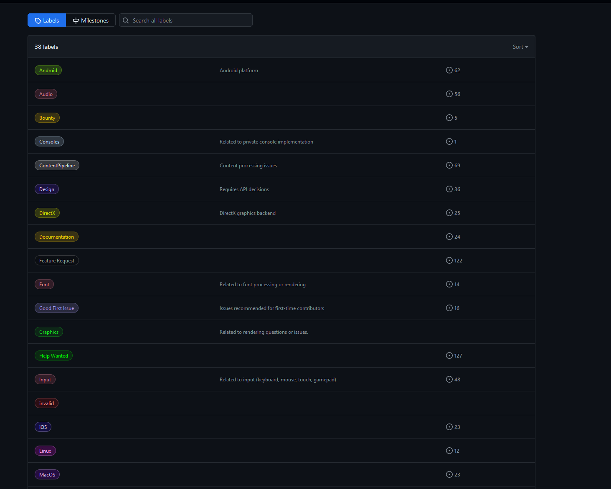
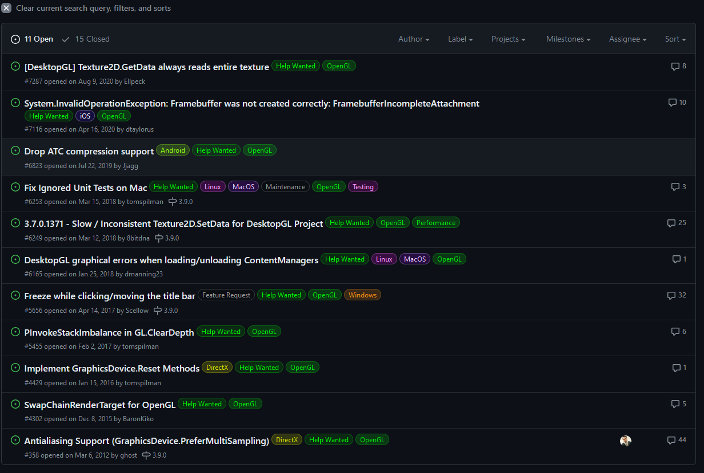
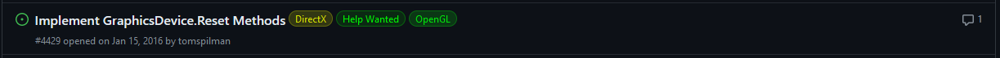
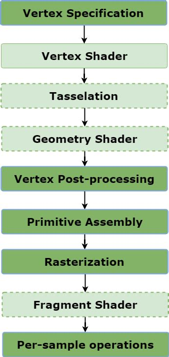
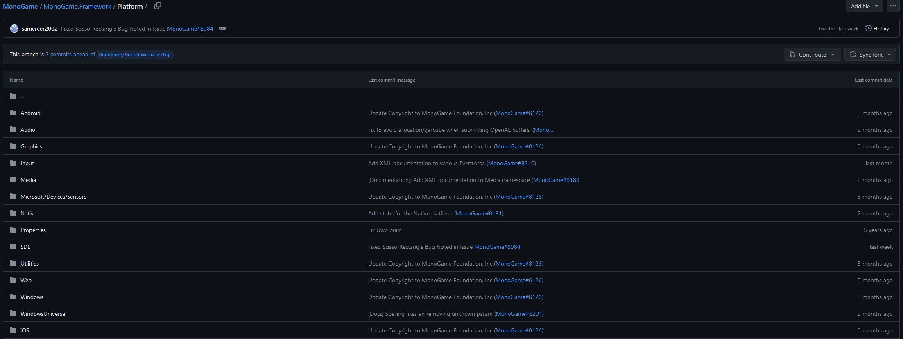
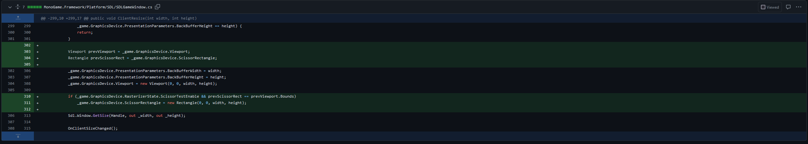
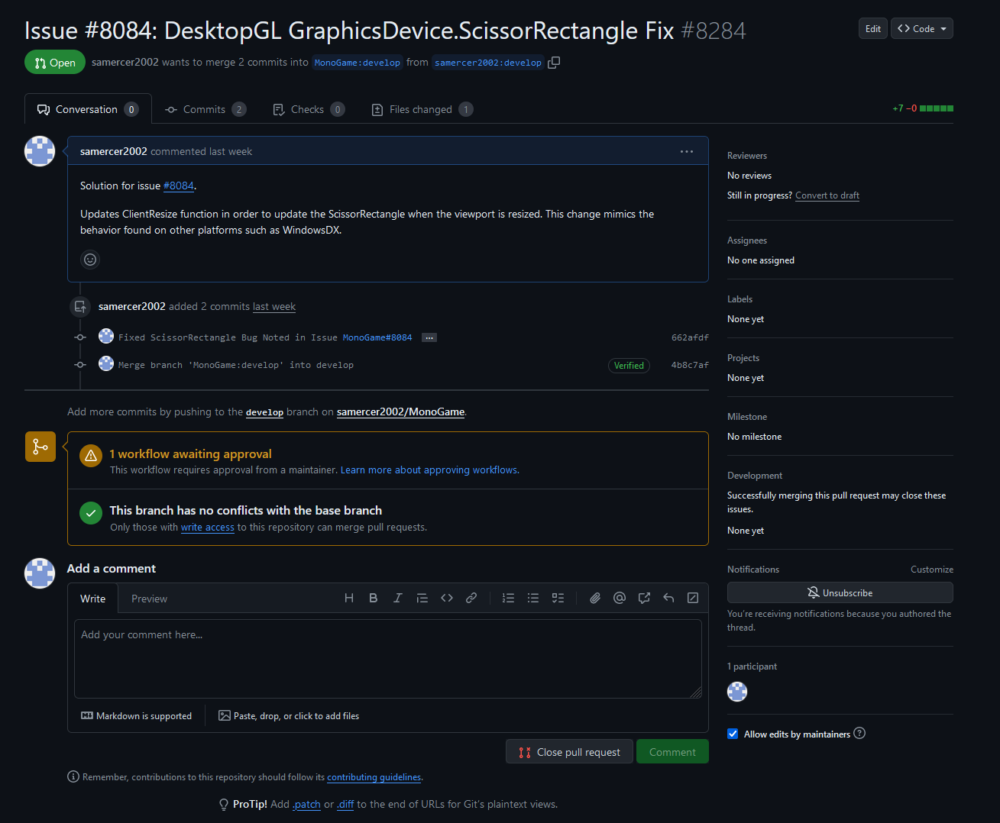

# Choosing an Issue

For my contribution, I wanted to work on an issue that was more familiar to my graphics programming background. Luckily, MonoGame has a lot of those issues laying around as they are hard to fix and require knowledge of multiple APIs. I had a quite a few tags to pick from with regards to issues. 

My next step was to look through these issues, sorted by tag of course, and pick one. Since I am pretty well rounded in my knowledge of different graphical APIs like DirectX 11 & 12, or OpenGL. I figured I'd focus my search on those tags and the Help Wanted, New Issue, and Graphics tags.

What I considered for issues were topics within those graphics APIs I was familiar with and things I could get done within a reasonable time frame. By a reasonable time frame, I set myself a deadline of May 1st to get my issue fixed and a PR submitted for review. That way, if I messed up and took longer, I had time to recover and get it done. Alternatively, swap to another issue if needed. Once those factors were considered, it knocked out some issues that were multi-platform issues. 

Now that I had my requirements for an issue, I went from most-recent issues to least-recent issues. The issue I ended up choosing was an inconsistency between graphics platforms regarding a Scissor Rectangle default implementation. This differed a lot from my bug fix as my bug fix had to do with the content pipeline of MonoGame and the documentation of MonoGame. The graphics component of MonoGame differs a lot as it is a lot lower level within MonoGame whereas the Content Pipeline and Documentation is very high level.

# What is a Scissor Rectangle?

A scissor rectangle is a rectangle that cuts the viewport's display area to the area within the rectangle. This is typically done after the rasterization of the rendering pipeline, and before the content is displayed on the user's screen. By default there is never a scissor rectangle in the scene. However, scissor rectangles can be useful for displaying certain multiple views that should only be certain sections of the same rendered area. For MonoGame, it assumes on the DirectX an UWP platforms that it should be the size of the viewport if it isn't given a size. On OpenGL/DesktopGL, however, this is never done. The intended behavior is that it follows the same logic so each platform is consistent with each other. 

# How was it Fixed?

With approaching and fixing this issue, I first started by debugging what is actually happening on the rendering side. Luckily, unlike my first issue for my bug fix, this issue is visible and exists. The issue is that the scissor rectangle is set to the viewport's side on initialization, but on resizing, the scissor rectangle doesn't stay the same size. Now, to debug this issue, I first cloned the sample project the initial poster provided that demonstrated the issue. Then I scowered the code base to see what functions got called by resizing the screen. This lead me to three functions in the GraphicsDevice class. 
<ol>
<li>PlatformClear()</li>
<li>PlatformApplyState()</li>
<li>ApplyRenderTargets()</li>
</ol>

These were confirmed as called at some point within the program's lifetime. First, I noticed that ApplyRenderTargets() was only ever called at the beginning of the program or whenever new render targets are set. However, this is only done at the beginning of the program or in very special circumstances. This function also correctly sets the scissor rectangle, so we know that this function is good and works as we want it to. PlatformClear is only called whenever GraphicsDevice.Clear() is called, and PlatformApplyState() is called every frame when the spritebatch ends its drawing and when PlatformClear() is called. 

One special thing to note briefly is that any PlatformXXX() function has its own platform-specific logic that handles it for each platform. So, our next step is to look into the problem platform's code. The DesktopGL platform is based off of SDL 2.0, so we must look into how resizing is handled. I did this like how I did the first section, throwing in unique Debug.WriteLine() calls for each function I thought might be called upon resizing. This lead me to the SDL Game Window file that contained all the logic for the game window for DesktopGL. Within this file I found one method that seemed to be the root cause of the issue, the ClientResize() function. Once I found that function and saw it was being called every frame where the game was being resized, I knew this is where the solution should be placed to guarantee our behavior.

First, I wrote some code to guarantee that the scissor rectangle would always be resized with the viewport. This worked as intended, however, there were some issues. Firstly, I never made it account for whether or not a scissor rectangle exists or if it was a default size. These two are crucial checks to the solution as they prevent errors and unintended behavior. The first check is easily done via the reference to GraphicsDevice the game window has. This prevented errors from an invalid scissor rectangle being resized or applied. The second check was done by saving off the unchanged viewport and comparing it to the scissor rectangle. If their bounds are the same, we know that the scissor rectangle must do its default behavior. Otherwise, the scissor rectangle should never be resized or moved by the program automatically.

# Resolution

On 4/18/2024, the PR for the proposed fix was submitted. As of 4/25/2024, the PR is still active and hasn't been reviewed by a maintainer yet. Typically a PR review can be up to a few weeks before they are reviewed.

