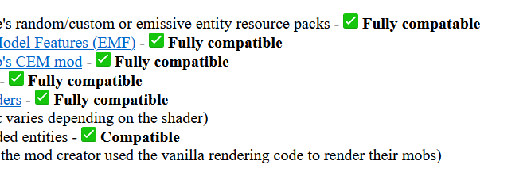
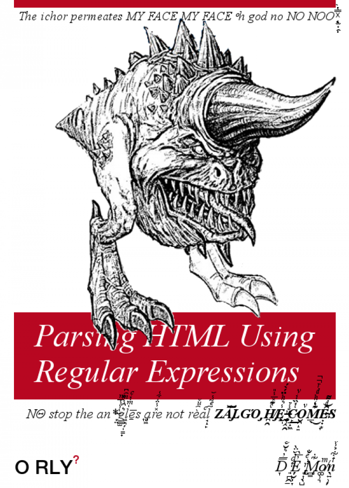
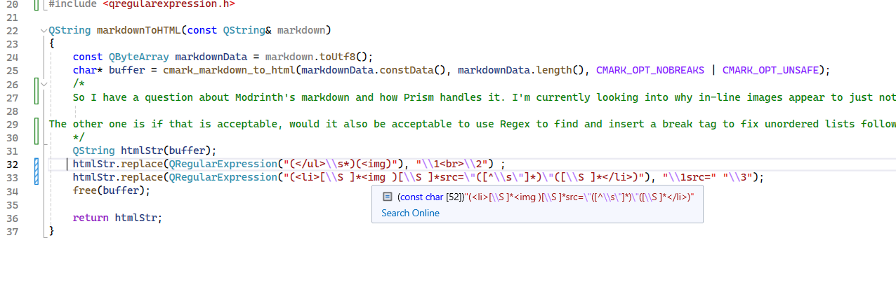
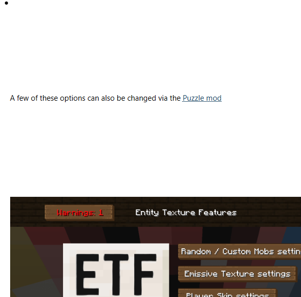
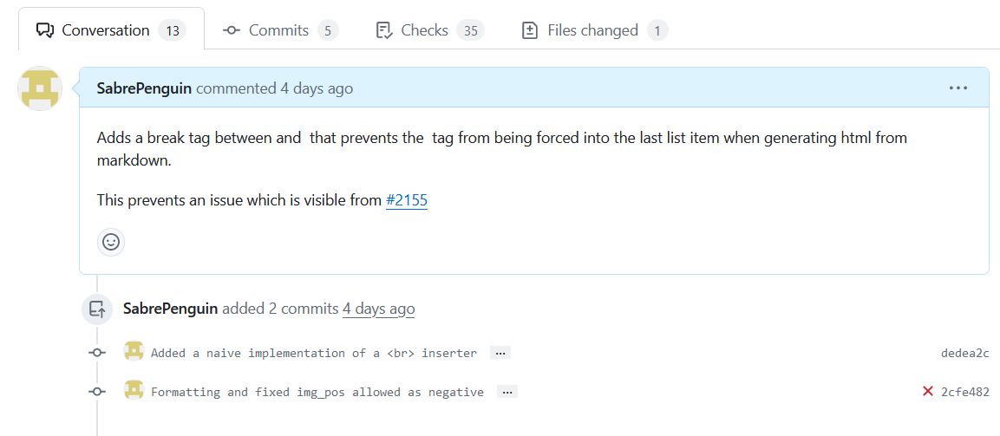
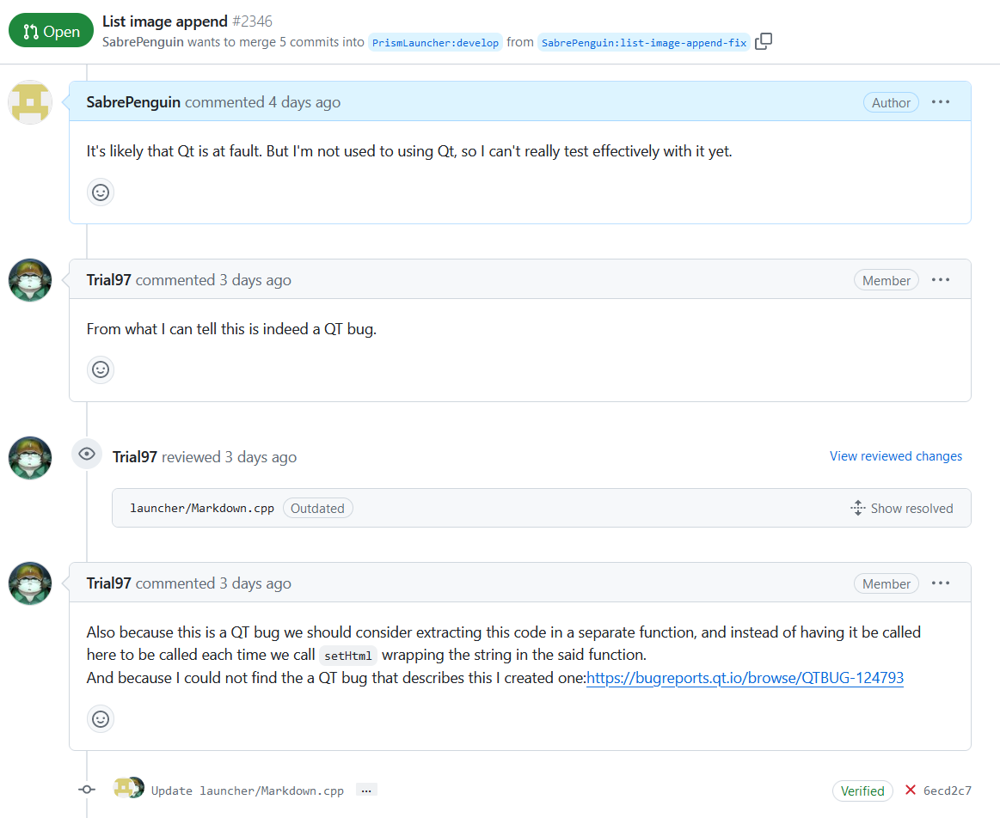
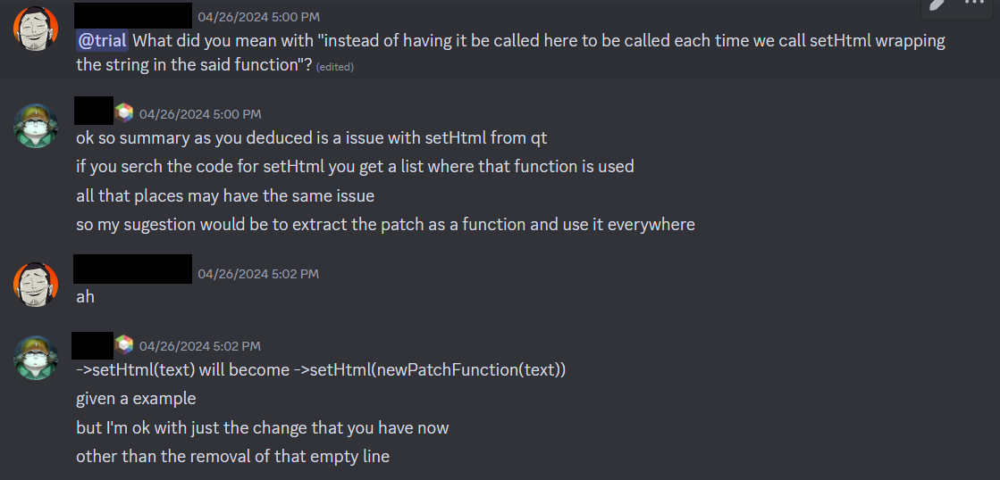

For my second bug fix/contribution/I don't know anymore, I chose Prism MC again. I searched through the open issues to find a somewhat simple thing to fix. I ended up selecting [Image Width property in HTML not respected](https://github.com/PrismLauncher/PrismLauncher/issues/2155), as it appeared to be a simple fix.

In contrast to my original Bug Fix/Contribution, this time around I was dealing with the source code of the launcher, and not just html. So I not only had to find the files that dealt with the bug, I also had to find the functions and libraries that may have an impact.

## Pursuing the Issue
Thanks to my contribution, my IDE was already set up to easily compile and debug Prism. I started by adding debug points to the locations that seemed likely candidates for failure. After a bit of poking around, I found the following relevant line

This led my pursuit to three different paths.

1. CMark. CMark is a markdown to HTML parser that produces a consistent output based on the markdown input.
2. Prism. Prism might be messing up the HTML width tag when rendering.
3. Qt. Qt is an open source C++ library and might be ignoring the tag.

I first investigated CMark. However, after some investigating, I managed to locate the output from CMark and got it's HTML. Plugging this into the browser gave

which clearly indicated that CMark was not at fault. This left Prism and Qt. At this point, I wasn't sure how to check if Qt was working right, and started digging. Finally, I found out how to get html from Qt. The object I was trying to get the data from was called QTextEditor, and allowed the user to extract the data inside by calling .toHtml(). Reading this showed me the html in Qt was just fine. This then led me to start modifying the html.

## Modifying the HTML

My initial thought was to use a Regex. I made a basic call as follows

that would capture and replace specific data. Testing showed that this worked, and which can be seen in the above browser image. I ended up removing the image source tag for the width property, as if the image didn't exist, the width would be respected. However, talking with the community made me understand how bad of an idea Regex with HTML is. However, this discussion ended up leading me to believe Prism's custom renderer (which I just discovered thanks to the converstaion) might be at fault. I went to sleep thinking I could spend some time the next day working on it.

When I woke up, I found that another maintainer had patched Prism's **ImplicitSize()** renderer and [fixed the width bug after my discussion](https://github.com/PrismLauncher/PrismLauncher/pull/2341). However, there was still a bug closely related, and I focused on that. That is, images following unordered lists would sometimes get appended to the list's last item and mess up the formatting.

So my bug fix was still on. After some thinking, I wrote a parser using QString built-in functions, and used it locate any \</ul> tags that were followed by \ tag between them. Satisfied with this, and seeing it fixed most bugs, I pushed a PR.

## The PR
A few hours later, the maintainer who fixed the first bug responded and asked if [their pr](https://github.com/PrismLauncher/PrismLauncher/pull/2341) fixed the issue. However, I informed them it did not. After a bit of back and forth with input from me, they and another maintainer came to the conclusion that the bug was caused by Qt itself. The first maintainer then proposed some changes

and I implemented them. After a final commit to satisfy the checker, I spoke on Discord with the maintainer a bit more for clarification on one of their comments.

As of now, the PR is not yet merged, and is only pending review from one more maintainer. I plan to follow up with another PR changing the patch to apply to all setHtml until Qt fixes the bug on their end.